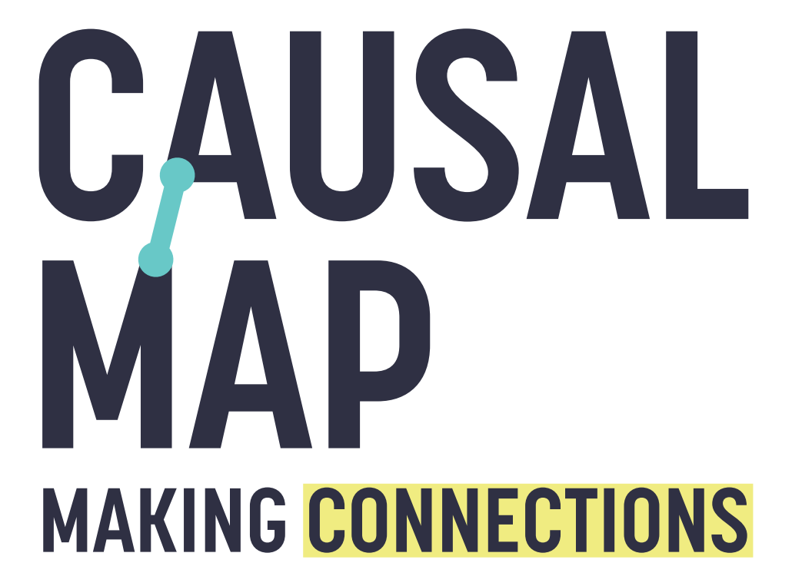

```{r setup0, include=FALSE}
knitr::opts_chunk$set(echo = FALSE,message=F,warning=F,error=F)
```

```{r setup, include=FALSE}
options(shiny.port = 9999);
library(learnr)
library(readr)
library(magrittr)
library(shiny)
library(markdown)
library(shinyWidgets)
library(purrr)
library(dplyr)
library(tidyr)
library(stringr)
replace_Inf <- function(x,replacement=0){
  # browser()
  ifelse(is.infinite(x),replacement , x)
}
replace_inf <- replace_Inf #alias

make_question <- function(tex){
  tmp <-
    tex %>%
    str_split("\n") %>%
    pluck(1) %>%
    str_trim %>%
    keep(.!="") %>%
                  str_replace_all("-->","$\\\\rightarrow$") %>%
                  str_replace_all("///","\n\n") %>%
                  str_replace_all("icon:([a-z]*)",shiny::icon("\\1") %>% as.character)%>%
    str_replace_all("_assets/","images/")
## transfer images from folder where typora puts them to folder where learnr can see them

  que <- tmp[1]
  incorrect <- tmp %>%
    keep(str_detect(.,"^hint ")) %>%
    first %>%
    replace_na("Incorrect") %>%
    str_remove("^hint ")

  tmp <- tmp %>% keep(!str_detect(.,"^hint "))

  ans <-
    tmp[-1] %>%
    as.list %>%
    map(~answer(str_remove(.,"^y ") %>%
                  str_trim,
                correct=str_detect(.,"^y "))) %>%
    c(que,.)

  do.call(mquestion,ans %>% c(incorrect=incorrect))

}
mquestion <- function(...){question(...,allow_retry = T,random_answer_order = T)}


make_quiz <- function(fil){
  # browser()
  tex <- read_lines(paste0("assets/",fil,".txt")) %>% paste0(collapse="\n")
  # tex <- source(paste0("assets/",fil,".txt"),local=T) %>% paste0("'",.,"'")
# should be readLines

  tmp <-
    tex %>%
    str_split("\n\n") %>%
    pluck(1) %>%
    str_trim %>%
    keep(.!="")  
  qs <-
    tmp %>%
    as.list %>%
    map(~make_question(.))

 do.call(quiz,qs)

}
myquiz <- function(...)
{
  quiz(...,allow_retry=T)
}


#  learning hub intro, not used

## transfer images from folder where typora puts them to folder where learnr can see them

list.files("assets/_assets") %>%
  {(file.copy(file.path("assets/_assets",.),file.path("images",.),overwrite=T,recursive=F))}

# note for js below: https://stackoverflow.com/questions/71603886/in-learnr-how-to-make-external-links-open-in-new-tab/71609357#71609357
```


```{js target-blank, echo=FALSE}
$(document).ready(function() {
  var links = document.getElementsByTagName('a');
  for (var i = 0; i < links.length; i++) {
    if (/^(https?:)?\/\//.test(links[i].getAttribute('href'))) {
      links[i].target = '_blank';
    }
  }
});
```


## Welcome to the Quiz Hub!




Check out our <a href="https://guide.causalmap.app" target="_blank">Guide</a> for all the answers on causal mapping and the <a href="https://causalmap.shinyapps.io/CM3main" target="_blank">Causal Map app</a>.


In the quizzes, you can attempt as many questions as you like from whichever sections you want.

If you return here from the same computer, you should find your answers saved.

If you get a question wrong, try again!


## 1: 📚 Causal coding{#xlevel1}

These quizzes are all about basic ideas about causal coding. 

You don't need to use the Causal Map app to do these quizzes.

First, read *these* sections of the Guide.

In some of these questions, we will use this "→" symbol to show a causal link made from X to Y:

X → Y

```{r coding}
make_quiz("2_coding")
```

## 📚 Causal claims

For each question, say if it is a causal claim or not.

```{r claims}
make_quiz("2_claims")
```


## 📚 Factors

For each question, say if it is a causal claim or not.

```{r claims2}
make_quiz("2_inf-cons")
```

## 📚 Factor labels

Before taking the quiz below, watch this [short video]([https://vimeo.com/580212681](https://vimeo.com/580212681)) which explains what makes a good factor label or refer to these [Guide sections]([https://guide.causalmap.app/creating-good-factor-labels.html?q=good#creating-good-factor-labels](https://guide.causalmap.app/creating-good-factor-labels.html?q=good#creating-good-factor-labels)).

Hierarchical coding can also improve your factor labels, so check out this video or this [guide section](https://guide.causalmap.app/xhierarchical-coding.html?q=hierachica#xhierarchical-coding) for more information.

```{r labs}
make_quiz("4_factor_labels")
```

## 📚 Zooming

After reading this section on [hierarchical coding and zooming](https://guide.causalmap.app/xsimplifying-with-hierarchical.html) try this quiz.


```{r levels}
make_quiz("5_levels")
```

## 📚 Tracing paths

Read up on <a href="https://guide.causalmap.app/xrobustness.html?q=tracing#xrobustness" target="_blank">tracing paths</a>, 
<a href="https://guide.causalmap.app/xcontinuity.html" target="_blank">continuity and tracing threads</a> in the guide and then test your knowledge with the quiz below!


```{r tracing}
make_quiz("5_tracing")
```

## 

## 3: 💻 Getting started with the app{#xlevel1}

All the other quizzes at this site are about how to use the Causal Map app.

First, read *these* sections of the Guide.


## 💻 First steps in the app

The first quizzes here follow the first sections of our [Guide](https://guide.causalmap.app).

```{r quiz0}
make_quiz("1_getting_started")

```

## 💻 The interface


First, read *these* sections of the Guide.

```{r quiz3}
make_quiz("1_the interface")
```


## 4: Basic coding in the app{#xlevel2}

First, read *these* sections of the Guide.


## 💻 Coding in the app

This short video explains how to code a single statement in Causal Map.

First, read *these* sections of the Guide.


In some of these questions, we will use this "→" symbol to show a causal link made from X to Y:

X → Y

```{r codingapp}
make_quiz("2_coding_in_the_app")
```

## 5: Basic analysis in the app{#xlevel3}

Welcome to level 3, basic analysis!

First, read *these* sections of the Guide.

## 💻 Analysis in the app

Once you have checked out the  [Level 3](https://guide.causalmap.app/xlevel3.html) section of the Guide, test your knowledge with this short quiz.

```{r labs22}
make_quiz("3_basic_analysis")
```
## 💻 The library

First, read *these* sections of the Guide.
## 💻 Tables

First, read *these* sections of the Guide.

## 6: Advanced coding{#xlevel4}

First, read *these* sections of the Guide.


## 7: Advanced analysis{#xlevel5}

First, read *these* sections of the Guide.

## 💻  Interpreting special hashtags


Like with any other kind of data analysis, in causal mapping you have to be careful to interpret your results correctly and that is what the next four quizzes will test you on. 

Have a read of [this Guide section](https://guide.causalmap.app/xinterpret.html).

You could also read up on [hashtags](https://guide.causalmap.app/xcoding-panel.html?q=hypoth#xhashtags).

This first quiz will test your knowledge on hashtags.

One thing to think about is, have you coded only explicit causal claims or have you also coded, for example:
•	hypothetical links
•	dreams / hopes / fears / wishes for the future
•	statements that something does NOT cause something else?


```{r interp}
#help_drop("xinterp",label="Read about interpreting maps")
#help_drop("xhashtags",label="Read about hashtags")
make_quiz("5_interp 1")
```

## 💻  Interpreting opposites

Combining opposites is a useful and powerful way of dealing with “negative” factors that have “positive” counterparts. A ‘~’ can be used to signify a negative i.e. ‘~good health’ can be read as ‘bad health’. This function is only useful if you are able to interpret your map after using it, so this quiz will test this.

Check out this [guide section](https://guide.causalmap.app/conditional-formats.html?q=condi#conditional-formats) before giving it a go.

```{r interp2}
make_quiz("5_interp 2")
```

## 💻 Interpreting source IDs 

There are quite a few potential pitfalls to interpreting causal maps! One of them is the [transitivity trap](https://guide.causalmap.app/xtransitivity-trap.html), so have a read of that section of the Guide.


Often on maps you will see the number of sources who mentioned the link written just above the link. Read [this section](https://guide.causalmap.app/conditional-formats.html?q=label%20#xformatting-links) of the guide to learn how to label your links. As the section on the [transitivity trap](https://guide.causalmap.app/xtransitivity-trap.html) explains it is important to understand that it may not be the same respondents reporting the entire causal claim, so you must be careful when interpreting source counts.


In these questions, you can assume

- all links have been encoded as normal causal claims, not for example as hypotheses or dreams or plans
- any numbers printed on the links are numbers of citations (quotes)

For each map, pick the best interpretation(s)


```{r interp3}
make_quiz("5_interp 3")
```

## 💻 Interpreting continuity

This quiz continues looking at avoiding the transitivity trap. By using the tracing threads filter after tracing robustness or tracing paths, you can visualise how many sources reported an entire chain of causal claims. Read this [section of the guide](https://guide.causalmap.app/xcontinuity.html?q=trace#xtracing-threads) for more information.

```{r interp4}
make_quiz("5_interp 4")
```

## 💻 Interpreting 'surprise'

By using the `surprise` filter, you can split your links into bundles for specific groups like women and men, and visualise whether the sources within a group mentioned the link surprisingly frequently or infrequently. Read this [section of the guide](https://guide.causalmap.app/comparing.html#xsurprise) for more information.

```{r surp}
make_quiz("5_surprise")
```

## 💻 Conditional formats

Conditional formats calculate and visualise information in your map, making your map easier to interpret.

Check out this [guide section](https://guide.causalmap.app/coding-opposites.html?q=oppo#combining-opposites) before giving it a go.

```{r conditional}
make_quiz("5_conditional formats")
```

## 💻 Advanced tips

Experts know all the short-cuts to make life quicker and simpler. Are you an expert?

```{r tips}
make_quiz("5_random")
```

## More quizzes coming soon!

```{r}


## Tables


#


## Filters


#

## Combining opposites


#


```
